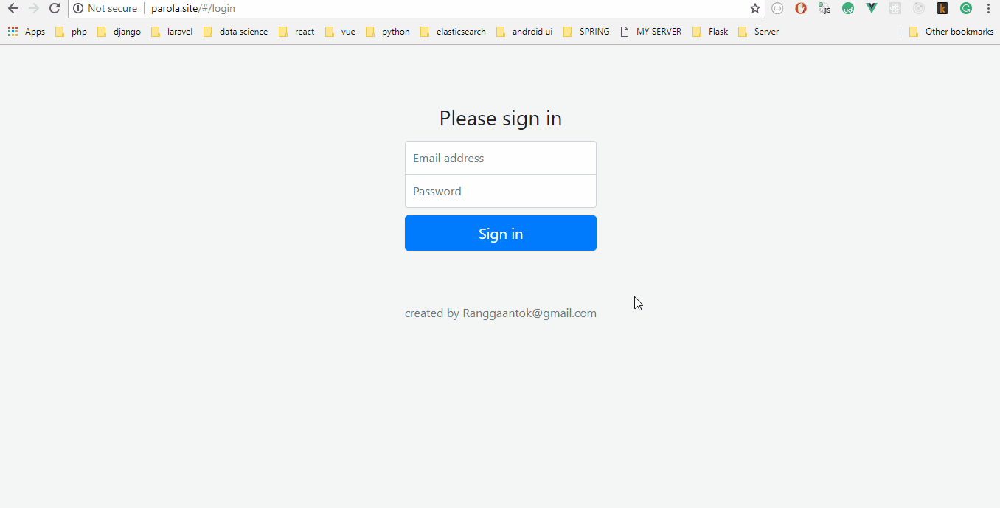

# PAROLA
Web Application of my Final Project

What can Parola do ?
1. Text Categorization using Correlation Measurement
2. Topic Modelling with Latent Dirchlect Allocation

about LDA baca disini https://medium.com/@ranggaantok/topic-modelling-menggunakan-latent-dirchlect-allocation-3fdf979ffd05

# Home

# Report

# Data Pengaduan

